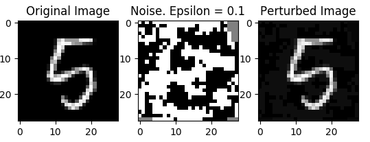

.. adversary:

Adversary
=====================================================
At present, the adversary has just a single pertubation method - FGSM. This works by computing the sign function of the derivative of network's cost function over the original image.

.. automodule:: adversary
  :members: